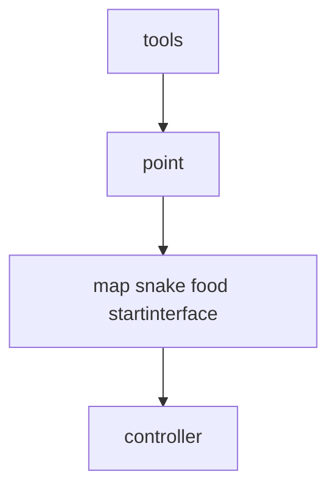

# 贪吃蛇游戏

> 1.界面动画 StartInterface
> 2.地图    map
> 3.蛇      snake
> 4.食物    food
> 5.控制光标 Tools
> 6.对象    Point
> 7.控制游戏过程 Controller

```mermaid
graph TD
A[tools] --> B[point]
    B   --> C[map snake food startinterface]
    C   --> D[controller]
```
